# Improving S&P 500 Volatility Forecasting through Regime-Switching Methods

**Ava Blake · Nivika Gandhi · Anurag Jakkula**  
*Columbia Summer Undergraduate Research Experiences in Mathematical Modeling*  
*Advised by George Dragomir, Vihan Pandey, Dobrin Marchev*

---

## About the Project

This repository contains the results, code, poster, and supporting materials for this research project on forecasting S&P 500 volatility using regime-switching methods. Here, we include more detailed results for comparison, and cover methods such as recursive forecasting which are not detailed in our poster. The project integrates techniques from financial econometrics and machine learning to improve volatility prediction accuracy by accounting for structural changes in market dynamics.

We explore a hybrid modeling framework that combines:

- Regime identification using methods like Hidden Markov Models (HMM), spectral clustering, and nonparametric change point detection (Mood test)
- Volatility modeling via HAR (Heterogeneous Autoregressive) models
- Forecasting enhancement with LSTM and Transformer neural networks
- Supervised learning using XGBoost to predict regime labels
- Clustering techniques to group similar volatility patterns

By incorporating these dynamic regime-based approaches, our models aim to better capture the nonlinear, heteroskedastic structure of financial time series data.

---

## Motivations

Market volatility forecasts are essential for portfolio management, risk control, derivatives pricing, and regulatory decisions. Traditional models like the Heterogeneous Autoregressive (HAR) model use past volatility over different time horizons (daily, weekly, monthly) to predict future volatility, assuming stable market dynamics with fixed parameters.

However, financial markets often move through distinct regimes, such as calm, crisis, and recovery phases, that cause volatility behavior to change over time. In these settings, the statistical relationship between past and future volatility is not constant, and fixed-parameter models may fail to capture such evolving patterns, reducing forecast accuracy.

Our research addresses these challenges by developing regime-aware forecasting frameworks that detect structural breaks and adapt to changing market conditions. By combining historical realized volatility with forward-looking indicators like the Implied Volatility Index (VIX), our models adjust dynamically to different volatility regimes, improving predictive performance.

Ultimately, this work enhances the robustness and reliability of volatility forecasts, supporting better-informed real-time decisions in risk management and hedging.

---

## Background

The original HAR model, introduced by Corsi (2009), was designed to capture realized volatility (RV) behavior across multiple time scales (daily, weekly, and monthly) reflecting the activity of different types of investors:

```
RV_t = β₀ + β_d · RV_{t-1} + β_w · RV̄_{t-1}^{(w)} + β_m · RV̄_{t-1}^{(m)} + ε_t
```

where β₀, β_d, β_w, β_m are the HAR parameters to be estimated, and ε_t is the error term.

Subsequent research has shown that while the HAR model captures important long-memory features, volatility dynamics often shift across distinct market regimes, exhibiting structural breaks and regime-dependent behavior. To better capture these time-varying patterns, regime-switching extensions of HAR have been proposed. For instance, Zhang et al. demonstrate that incorporating regime switching enhances forecasts of Chinese stock market volatility by accounting for structural shifts driven by international markets.

---

## Data Collection

Our dataset consists of high-frequency intraday price data for the S&P 500 index (SPX), spanning eleven years from June 2, 2014 to April 29, 2025, sourced via Bloomberg Terminal. Using 5-minute closing prices, we calculate intraday log-returns as:

```
r_{t,i} = ln(P_{t,i} / P_{t,i-1})
```

These returns are then aggregated to compute daily realized volatility (RV), adjusted to account for shorter trading days:

```
RV_t = sqrt(N/n * Σ r_{t,i}²)
```

Here, n is the number of intraday returns observed on day t (which may vary due to holidays), and N is the standard number of returns in a full trading day—78 for intraday data only, or 79 including overnight returns. This scaling ensures comparability of RV across days with varying lengths.

---

## Feature Engineering

We extend the HAR model by introducing a dual-memory structure that captures both historical volatility patterns and forward-looking market sentiment. Our model applies HAR-style lags to implied volatility features (VIX), allowing the model to respond to shifts in investor expectations.

To build this structure, we engineered:

- Lagged VIX values (daily, 5-day, 22-day): market fear over varying time horizons  
- Short-term reversal factor (STR): captures recent return reversals and mean reversion  
- Realized kurtosis: measures tail risk and extreme return behavior  
- Jump variation: isolates large discontinuous price moves from continuous volatility  

This feature design allows the model to adapt across regimes by integrating both behavioral and structural signals, improving forecast accuracy under changing market conditions.

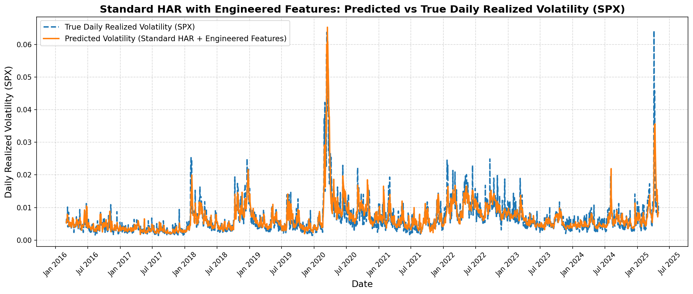

<p align="center"><strong>Figure 1:</strong> Feature-engineered standard HAR model over the eleven-year period.</p>

---

## Methodology Overview

Traditional regime switching models use techniques such as Markov regime-switching, implementing a Hidden Markov Model (HMM) to capture volatility behavior as the market evolves through differing regimes. Our models build off of existing frameworks and introduce new regime-switching techniques.

1. **Soft Markov Regime Switching**  
   Gaussian HMM on smoothed volatility → soft regime probabilities → weighted WLS/Ridge in EM loop → forward-propagated regime weights for smooth forecasts.

We extend HAR by fitting a Gaussian HMM to smoothed volatility and estimating soft regime probabilities. These probabilities are used to weight regime-specific WLS or Ridge regressions within an Expectation-Maximization (EM) loop. Forecasts are blended using forward-propagated regime weights for smooth, robust transitions.

2. **Distributional Clustering with Spectral-XGBoost**  
   Mood test + Wasserstein clustering → HAR models per cluster → XGBoost for test-time regime prediction.

We detect regime shifts using the Mood test and cluster segments via Wasserstein distances and spectral clustering. Each cluster has an HAR model, with XGBoost assigning regimes at test time. This enables structural break adaptation based on feature distributions.

4. **Coefficient-Based Soft Clustering**  
   HAR coefficients → PCA + BGMM → soft regime weights → WLS per regime → XGBoost for smooth forecasts.

We extract HAR coefficients from mood-based segments and cluster them using PCA and BGMM to obtain soft regime weights. These weights inform WLS regressions per regime. XGBoost predicts regime probabilities, allowing for smooth, probabilistic forecasts.

---

## Model Comparisons

Model performance is evaluated across Pre-COVID, COVID, and Post-COVID periods using MAPE and MSE metrics. Regime-aware models consistently outperform the baseline HAR model.

### Pre-COVID Results 
|      Model               |   MAPE  |   MSE  | Regime # | # Days Forecasted| 
|--------------------------|---------|--------|----------|------------------|
| HAR                      |  27.09  |  3.40  |    1     |        5         |
| Markov Soft EM           |  24.33  |  3.12  |    3     |        5         |
| Distributional Clustering|  25.89  |  3.55  |    2     |        5         |
| Coefficient Clustering   |  23.92  |  3.11  |    2     |        5         |


<p align="center">
  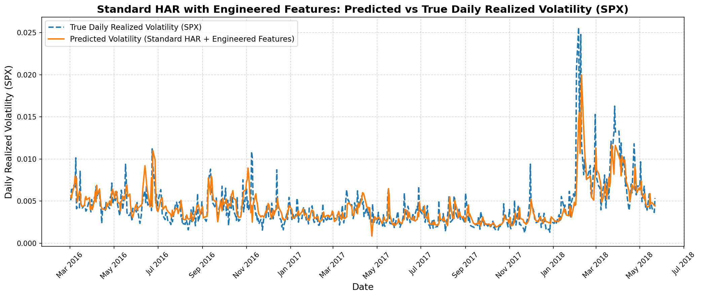
  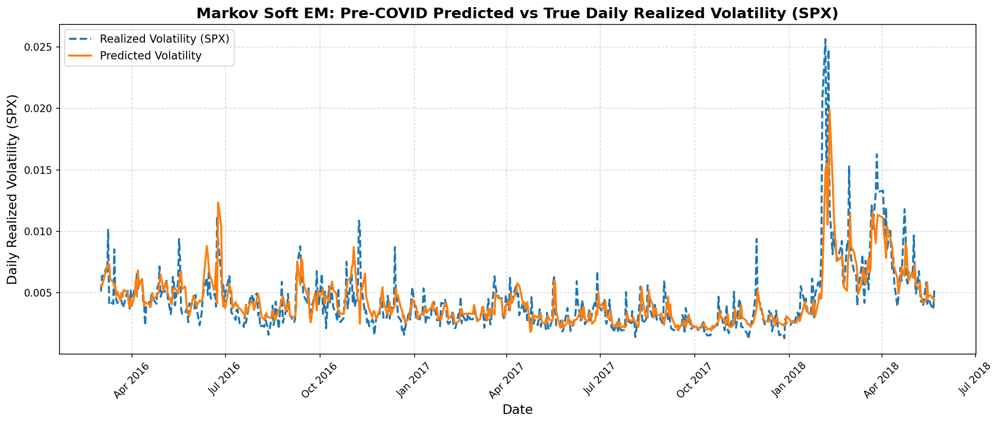
</p>

<p align="center">
  <em>Figure 2: HAR (left) &nbsp;&nbsp;&nbsp;&nbsp; Figure 3: Markov Soft EM (right)</em>
</p>

<p align="center">
  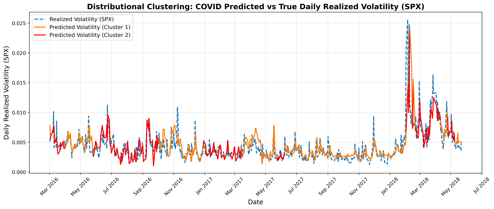
  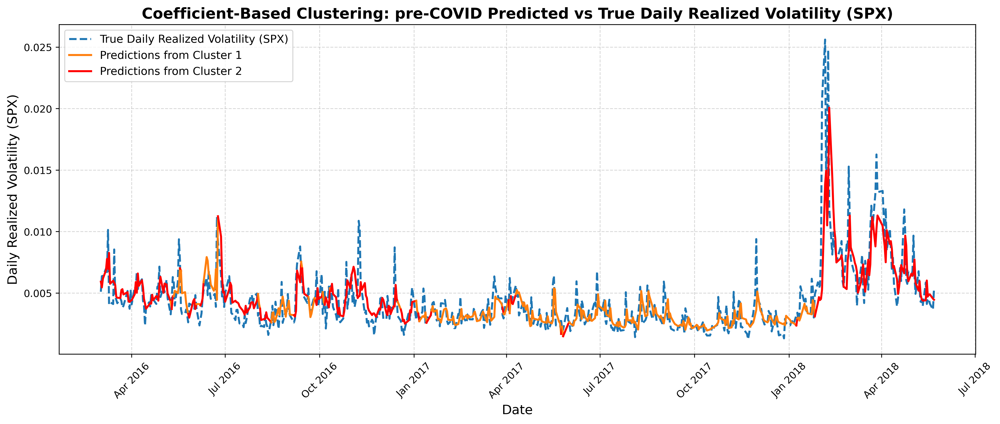
</p>

<p align="center">
  <em>Figure 4: Distributional Clustering (left) &nbsp;&nbsp;&nbsp;&nbsp; Figure 5: Coefficient Clustering (right)</em>
</p>


### COVID Results
|      Model               |   MAPE  |    MSE   | Regime # | # Days Forecasted|
|--------------------------|---------|----------|----------|------------------|
| HAR                      |  30.13  |   35.35  |    1     |        10        |
| Markov Soft EM           |  31.93  |   36.22  |    2     |        10        |
| Distributional Clustering|  32.63  |   33.59  |    2     |        10        |
| Coefficient Clustering   |  30.62  |   31.91  |    2     |        10        |


<p align="center">
  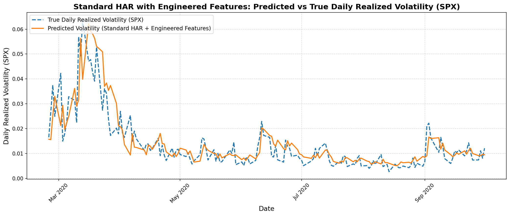
  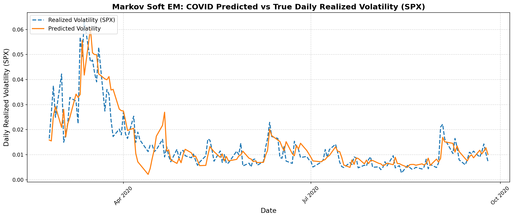
</p>

<p align="center">
  <em>Figure 6: HAR (left) &nbsp;&nbsp;&nbsp;&nbsp; Figure 7: Markov Soft EM (right)</em>
</p>

<p align="center">
  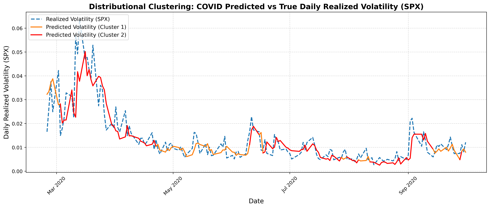
  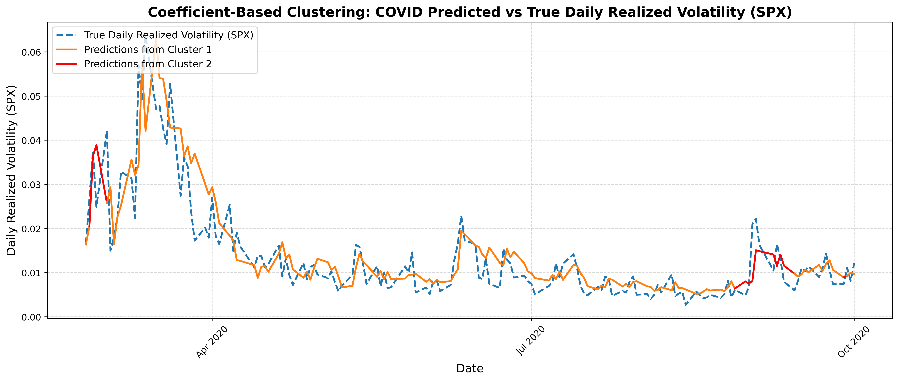
</p>

<p align="center">
  <em>Figure 8: Distributional Clustering (left) &nbsp;&nbsp;&nbsp;&nbsp; Figure 9: Coefficient Clustering (right)</em>
</p>

### Post-COVID Results 
|      Model               |   MAPE  |   MSE  | Regime # | # Days Forecasted| 
|--------------------------|---------|--------|----------|------------------|
| HAR                      |  23.31  |  8.63  |    1     |        5         |
| Markov Soft EM           |  22.45  |  7.66  |    2     |        5         |
| Distributional Clustering|  23.30  |  7.91  |    2     |        5         |
| Coefficient Clustering   |  22.70  |  7.60  |    2     |        5         |


<p align="center">
  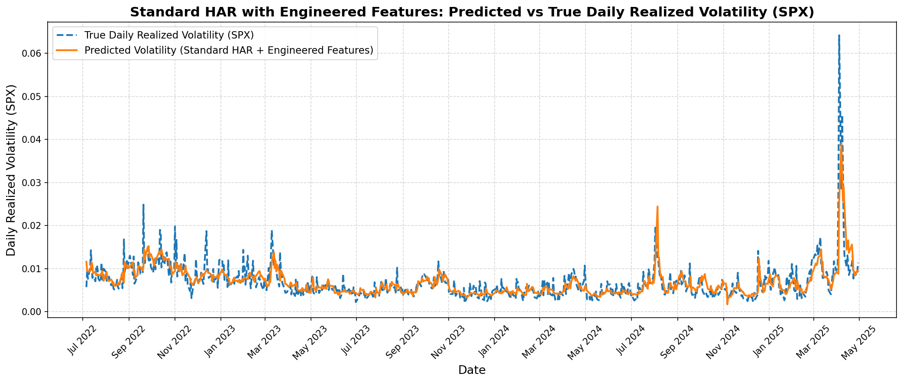
  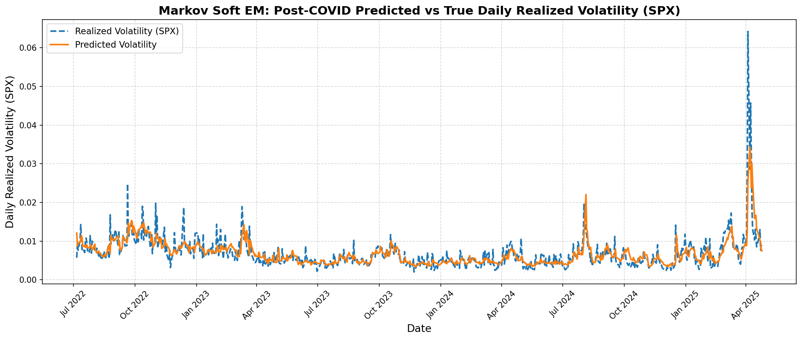
</p>

<p align="center">
  <em>Figure 10: HAR (left) &nbsp;&nbsp;&nbsp;&nbsp; Figure 11: Markov Soft EM (right)</em>
</p>

<p align="center">
  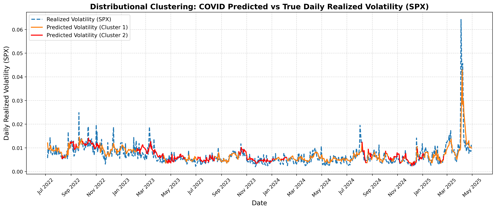
  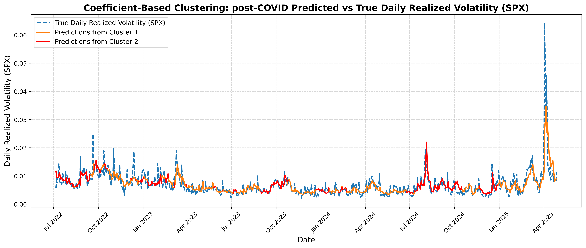
</p>

<p align="center">
  <em>Figure 12: Distributional Clustering (left) &nbsp;&nbsp;&nbsp;&nbsp; Figure 13: Coefficient Clustering (right)</em>
</p>


## Recursive Forecasting
We extend the HAR framework by generating multi-step-ahead forecasts of realized volatility through a recursive procedure, where each forecasted value is fed into the model as an input for predicting the next time step. This allows the model to capture compounding effects and evolving volatility patterns beyond one-day horizons.

To more accurately capture the interdependent dynamics between realized and implied volatility, we develop a dual-recursive HAR-VIX framework. This approach jointly models and forecasts RV and VIX over time. At each recursive forecasting step, we first generate a forecast for VIX using both its own lags and the RV lags. This forecasted VIX is then used as an input, along with RV lags, to predict RV. The process repeats recursively, allowing the predictions for the two volatility measures to co-evolve and influence each other dynamically. This structure enables the model to capture feedback effects between market expectations (VIX) and realized outcomes (RV), which are often observed during periods of market stress or change. The only features in the recursive models are those which are being forecasted, as using feature's real values introduces look-ahead bias as the model forecasts future days based on previous predictions. The dual-recursive structure thus enables the use of VIX as a feature without introducing look-ahead bias, as it ensures that only forecasted values are used at each step while still allowing for features to enhance model accuracy.

Both the single and dual-recursive HAR frameworks are implemented within our regime-switching modeling pipelines. For each regime, determined via segmentation and clustering methods previously discussed, we estimate regime-specific model parameters. The dual-recursive approach is particularly well-suited to this regime-aware setting, as it accounts for dynamic interactions between RV and VIX within each structural regime.
## 5-day Forecast Horizon Results 

### Pre-COVID Results 
|      Model                    |   MAPE  |   MSE  | Regime # | # Days Forecasted| 
|-------------------------------|---------|--------|----------|------------------|
| HAR                           |  38.19  |  6.22  |    1     |        5         |
| Markov Soft EM                |  38.18  |  6.22  |    2     |        5         |
| Distributional Clustering     |  39.39  |  6.47  |    2     |        5         |
| Coefficient Clustering        |  39.45  |  5.51  |    2     |        5         |
| Dual HAR                      |  37.83  |  6.17  |    1     |        5         |
| Dual Markov Soft EM           |  37.04  |  6.15  |    2     |        5         |
| Dual Distributional Clustering|  34.41  |  6.19  |    2     |        5         |
| Dual Coefficient Clustering   |  38.10  |  5.51  |    2     |        5         |

<p align="center">
  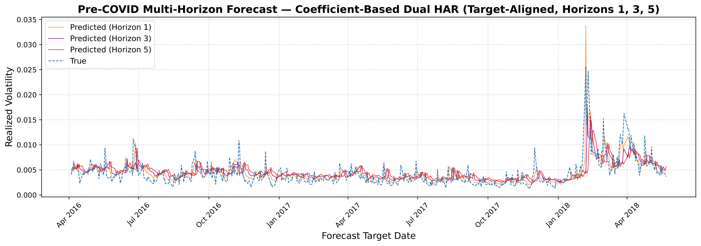
</p>

### COVID Results
|      Model                    |   MAPE  |    MSE   | Regime # | # Days Forecasted|
|-------------------------------|---------|----------|----------|------------------|
| HAR                           |  40.03  |   101.7  |    1     |         5        |
| Markov Soft EM                |  42.98  |   96.96  |    2     |         5        |
| Distributional Clustering     |  38.46  |   98.20  |    2     |         5        |
| Coefficient Clustering        |  39.40  |   101.6  |    2     |         5        |
| Dual HAR                      |  52.39  |   155.0  |    1     |         5        |
| Dual Markov Soft EM           |  60.39  |   149.7  |    2     |         5        |
| Dual Distributional Clustering|  47.79  |   77.85  |    2     |         5        |
| Dual Coefficient Clustering   |  55.14  |   391.1  |    2     |         5        |

<p align="center">
  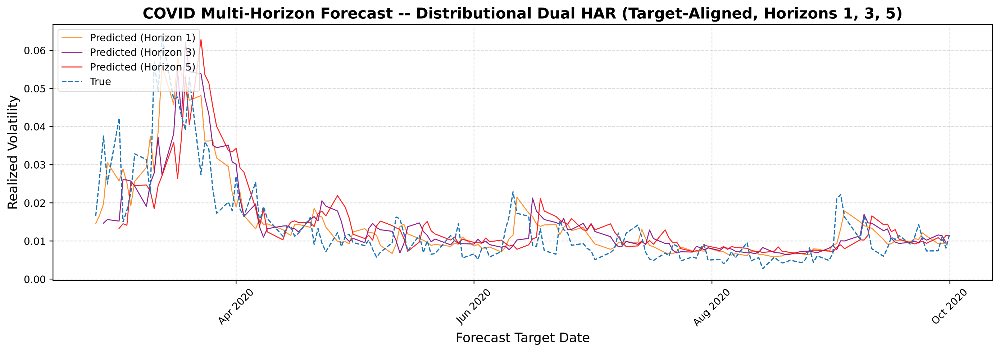
</p>

### Post-COVID Results
|      Model                    |   MAPE  |    MSE   | Regime # | # Days Forecasted|
|-------------------------------|---------|----------|----------|------------------|
| HAR                           |  34.90  |   21.48  |    1     |         5        |
| Markov Soft EM                |  34.85  |   20.94  |    2     |         5        |
| Distributional Clustering     |  36.70  |   23.69  |    2     |         5        |
| Coefficient Clustering        |  33.91  |   15.59  |    2     |         5        |
| Dual HAR                      |  32.25  |   16.44  |    1     |         5        |
| Dual Markov Soft EM           |  31.41  |   16.04  |    2     |         5        |
| Dual Distributional Clustering|  32.21  |   18.30  |    2     |         5        |
| Dual Coefficient Clustering   |  32.02  |   14.38  |    2     |         5        |

<p align="center">
  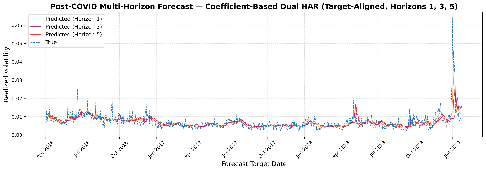
</p>

## 10-day Forecast Horizon Results

### Pre-COVID Results 
|      Model                    |   MAPE  |   MSE  | Regime # | # Days Forecasted | 
|-------------------------------|---------|--------|----------|-------------------|
| HAR                           |  38.19  |  6.22  |    1     |        10         |
| Markov Soft EM                |  38.18  |  6.22  |    2     |        10         |
| Distributional Clustering     |  39.39  |  6.47  |    2     |        10         |
| Coefficient Clustering        |  39.45  |  5.51  |    2     |        10         |
| Dual HAR                      |  37.83  |  6.17  |    1     |        10         |
| Dual Markov Soft EM           |  37.04  |  6.15  |    2     |        10         |
| Dual Distributional Clustering|  34.41  |  6.19  |    2     |        10         |
| Dual Coefficient Clustering   |  38.10  |  5.50  |    2     |        10         |

<p align="center">
  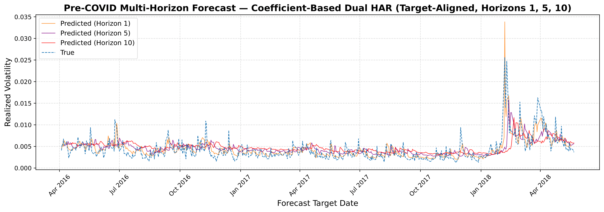
</p>

### COVID Results
|      Model                    |   MAPE  |   MSE   | Regime # | # Days Forecasted | 
|-------------------------------|---------|---------|----------|-------------------|
| HAR                           |  40.03  |  101.7  |    1     |        10         |
| Markov Soft EM                |  42.98  |  96.96  |    2     |        10         |
| Distributional Clustering     |  38.46  |  98.20  |    2     |        10         |
| Coefficient Clustering        |  39.40  |  101.7  |    2     |        10         |
| Dual HAR                      |  52.39  |  155.0  |    1     |        10         |
| Dual Markov Soft EM           |  60.39  |  149.7  |    2     |        10         |
| Dual Distributional Clustering|  47.79  |  77.85  |    2     |        10         |
| Dual Coefficient Clustering   |  55.14  |  391.1  |    2     |        10         |

<p align="center">
  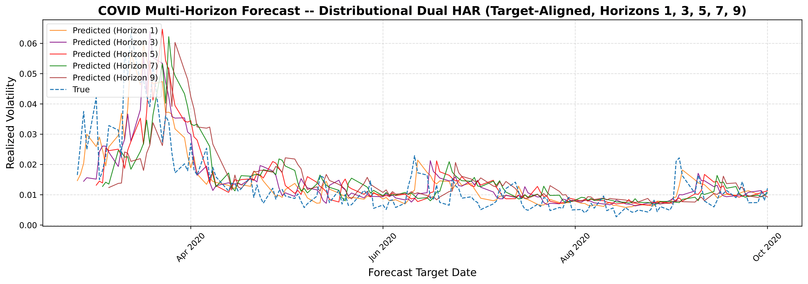
</p>

### Post-COVID Results
|      Model                    |   MAPE  |   MSE   | Regime # | # Days Forecasted | 
|-------------------------------|---------|---------|----------|-------------------|
| HAR                           |  34.90  |  21.48  |    1     |        10         |
| Markov Soft EM                |  34.85  |  20.94  |    2     |        10         |
| Distributional Clustering     |  36.70  |  23.69  |    2     |        10         |
| Coefficient Clustering        |  33.91  |  15.59  |    2     |        10         |
| Dual HAR                      |  32.25  |  16.44  |    1     |        10         |
| Dual Markov Soft EM           |  31.41  |  16.04  |    2     |        10         |
| Dual Distributional Clustering|  32.21  |  18.30  |    2     |        10         |
| Dual Coefficient Clustering   |  32.02  |  14.38  |    2     |        10         |
<p align="center">
  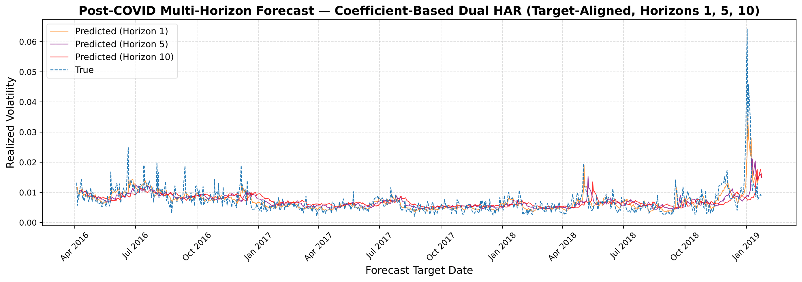
</p>

### Analysis 
Across all periods, regime-switching models generally outperformed the baseline HAR model. In particular, the Coefficient-Based Clustering model achieved the lowest MSE during all time periods. It consistently reduced MSE compared to the standard HAR model, with improvements of 8.52\% (Pre-COVID), 9.73\% (COVID), and 11.9\% (Post-COVID).MAPE values showed a similar pattern in the pre- and post-COVID periods, confirming improved predictive accuracy for short-term volatility movements. The Markov regime-switching followed closely in the pre-COVID and post-COVID time periods, outperforming the standard non-regime-switching model in both time periods. The highly volatile COVID time period proved to be more difficult for the Markov HAR to predict, and the standard model was marginally more accurate. This may reflect the Markov model's limitations in adapting quickly to sharp, irregular market transitions during crisis periods. However, the Distributional Clustering model and Coefficient-Based Clustering model were better suited to handle abrupt structural breaks and regime shifts in volatility, leading to slightly improved performance during this unstable period. For most models, the optimal number of regimes was between two and three, suggesting that market dynamics can often be meaningfully described by a few distinct volatility states. Overall, the consistent reduction in MSE across all periods suggests that the regime-switching models not only improve average forecast accuracy but also better controls for large mispredictions, which is an important property to address for in volatility forecasting. We believe the Coefficient-Based Clustering method likely performed best because it captures the direct relationship between input features and volatility dynamics, leading to more informative regime distinctions. Figures \ref{fig:pre} through \ref{fig:post} illustrate the time series forecasts from the top-performing models in each period. Here, we can see how the Coefficient-Based Clustering model visibly adapts to local structural shifts across time periods. 

In the 5-day recursive forecasting models, visualized in Figure \ref{fig:recursive-5day}, the Coefficient-based Clustering model implemented with a dual-recursive structure achieves the lowest MSE of $4.46 \times 10^{-6}$ in the Pre-COVID period. This highlights the benefit of allowing regime-specific coefficients to reflect the stable relationships present during calm market conditions. During the COVID period, which is characterized by heightened volatility and structural breaks, the Distributional Clustering model with dual-recursive forecasting delivers the most accurate predictions. This result suggests that segmenting regimes based on distributional properties provides robustness in environments that are marked by sharp changes in volatility behavior. In the Post-COVID period, the Coefficient-based Clustering model again outperforms all others under the dual-recursive framework, with an MSE of $12.17\times 10^{-6}$, indicating that this model adapts well to normalized but structurally evolved post-crisis dynamics.

In the 10-day recursive setting seen in Figure \ref{fig:recursive-10day}, forecasting accuracy generally declines, as expected, due to the increased uncertainty associated with longer horizons. However, the patterns across models remain consistent. The Coefficient-based Clustering model under the dual-recursive structure again achieves the best performance in the Pre-COVID period. During the COVID period, the Distributional Clustering model performs best, mirroring its relative advantage under stress conditions observed in the 5-day forecasts. In the Post-COVID period, the Coefficient-based Clustering model once again leads.

Across both forecasting horizons, dual-recursive implementations consistently outperform their single-recursive counterparts. By allowing both series (realized volatility and implied volatility) to evolve together and by capturing interdependent dynamics over time, the dual-recursive framework provides a significant forecasting advantage. Notably, the Coefficient-based Clustering model performs best during the more stable Pre- and Post-COVID periods, while the Distributional Clustering model proves more resilient during the turbulent COVID period. Meanwhile, the Markov Soft EM model, while theoretically grounded, underperforms relative to clustering-based methods, especially during volatile periods. The superior performance of clustering-based models under a dual-recursive framework aligns with performances of the models in a non-recursive setting. These outcomes thus underscore the importance of flexible, adaptive structures that can effectively capture the nonlinear and regime-dependent properties of volatility.
## Significance

Our empirical results demonstrate that regime-aware HAR extensions consistently yield lower forecasting errors than the standard HAR model, confirming the value of incorporating time-varying dynamics. Specifically, coefficient-based soft clustering effectively captures gradual shifts and identifies structural breaks in volatility distributions, achieving superior performance before and after the COVID time period. Meanwhile, distributional clustering better captures volatility behavior during the highly volatile COVID-19 time period. Inclusion of the VIX as a forward-looking feature enhances model responsiveness to shifts in market sentiment, thereby refining predictive accuracy.

These outcomes illustrate that volatility dynamics exhibit regime-dependent statistical properties, and that flexible models adapting regime-specific parameters provide a meaningful advantage. Future research could explore hybrid frameworks that integrate clustering and Markov switching, as well as advanced sequential models like LSTMs to capture more complex temporal dependencies.


---

## References

```
@article{zhang_Chinese_International_regime_switching,
    author = "Y. Zhang and L. Lei and Y. Wei",
    title = "Forecasting the Chinese stock market volatility with international market volatilities: The role of regime switching",
    journal = "The North American Journal of Economics and Finance",
    year = 2020,
    volume = 52,
    number = 101145
}

@article{luo_infinite_HAR_HMM,
    author = "J. Luo and T. Klein and Q. Ji and C. Hou",
    title = "Forecasting realized volatility of agricultural commodity futures with infinite Hidden Markov HAR models",
    journal = "International Journal of Forecasting",
    year = 2022,
    volume = 38,
    number = 1,
    pages = "51-73"
}

@article{gallo_Changing_average,
    author = "G. M. Gallo and E. Otranto",
    title = "Forecasting realized volatility with changing average levels",
    journal = "International Journal of Forecasting",
    year = 2020,
    volume = 52,
    number = 3,
    pages = "620-634"
}

@article{ding_regine_switching,
    author = "Y. Ding and D. Kambouroudis and D. G. McMillan",
    title = "Forecasting realised volatility using regime-switching models",
    journal = "International Review of Economics \& Finance",
    year = 2025,
    volume = 101,
    number = 104171,
}

@article{sullivan_vol_lstm,
    author = "J. C. Sullivan",
    title = "Stock Price Volatility Prediction with Long Short-Term Memory Neural Networks",
    journal = "Stanford University",
    year = 2018,
}

@article{bucci_vol_NN,
    author = "A. Bucci",
    title = "Realized Volatility Forecasting with Neural Networks",
    journal = "Munich Personal RePEc Archive",
    year = 2019,
    number = 95443,
}

@article{li_HAR_LSTM,
    author = "X. Li and D. Li and Y. Cheng and W. Li",
    title = "Forecasting the volatility of educational firms based on HAR model and LSTM models considering sentiment and educational policy",
    journal = "Heliyon",
    year = 2024,
    volume = 10,
    number = 19,
}

@online{stavrianos_HARRV,
    author = "S. Stavrianos",
    title = "Forecasting S&P 500 Volatility with the HAR-RV Model",
    year = 2024,
    url = "https://www.stavrianoseconblog.eu/2024/09/forecasting-volatility-with-har-rv.html",
}

@article{clements_harnessing_HAR_vol,
    author = "A. Clements and D. P. A. Preve",
    title = "A Practical Guide to harnessing the HAR volatility model",
    journal = "Journal of Banking & Finance",
    year = 2021,
    volume = 133,
    number = 106285,
}

@article{hu_HAR_graphNN,
    author = "N. Hu and X. Yin and Y. Yao",
    title = "A novel HAR-type realized volatility forecasting model using graph neural network",
    journal = "International Review of Financial Analysis",
    year = 2025,
    volume = 98,
    number = 103881,
}

@article{corsi,
    author = "F. Corsi",
    title = "A Simple Approximate Long-Memory Model of Realized Volatility",
    journal = "Journal of Financial Econometrics",
    year = 2009,
    volume = 7,
    number = 2,
    pages = "174-196"
}

@online{WagnerInvestopedia,
    author = "H. Wagner",
    title = "Why Volatility Is Important for Investors",
    year = 2022,
    url = "https://www.investopedia.com/articles/financial-theory/08/volatility.asp"
}

@article{gunnarsson_implications,
    author = "E. S. Gunnarsson and H. R. Isern and A Kaloudis and M. Risstad and B. Vigdel and S. Westgaard",
    title = "Prediction of realized volatility and implied volatility indices using AI and machine learning: A review",
    journal = "International Review of Financial Analysis",
    year = 2024,
    volume = 93,
    number = 103221,
}

@article{hamilton_regime_switching,
    author = "J. D. Hamilton",
    title = "A New Approach to the Economic Analysis of Nonstationary Time Series and the Business Cycle",
    journal = "Econometrica",
    year = 1989,
    volume = 52,
    number = 2,
    pages = "357-384"
}

@article{Prakash_2021,
   title={Structural Clustering of Volatility Regimes for Dynamic Trading Strategies},
   volume={28},
   ISSN={1466-4313},
   url={http://dx.doi.org/10.1080/1350486X.2021.2007146},
   DOI={10.1080/1350486x.2021.2007146},
   number={3},
   journal={Applied Mathematical Finance},
   publisher={Informa UK Limited},
   author={A. Prakash and N. James and M. Menzies and G. Francis},
   year={2021},
   month=may, pages={236–274} 
}

@article{Zheng_ClusteringHiddenMarkov,
    author = "K. Zheng and Y. Li and W. Xu",
    title = "Regime switching model estimation: spectral clustering hidden Markov model",
    journal = "Annals of Operations Research",
    year = 2019
}

@phdthesis{Wang_hybridmodel,
    author = {X. Wang},
    title = {Hybrid Volatility Forecasting Models Based on Machine Learning of High-Frequency Data},
    school = {Florida State University College of Arts and Sciences},
    year = 2022,
}

@article{Hu_hybridmodel,
    title = {Forecasting volatility of China’s crude oil futures based on hybrid ML-HAR-RV models},
    journal = {The North American Journal of Economics and Finance},
    volume = {78},
    pages = {102428},
    year = {2025},
    issn = {1062-9408},
    doi = {https://doi.org/10.1016/j.najef.2025.102428},
    url = {https://www.sciencedirect.com/science/article/pii/S1062940825000683},
    author = {G. Hu and X. Ma and T. Zhu},
}

@article{Otranto_bayesian,
    author = {E. Otranto and G. M. Gallo},
    title = {A Nonparametric Bayesian Approach to Detect the Number of Regimes in Markov Switching Models},
    journal = {Econometric Reviews},
    year = {2007}
}

@inproceedings{jebara_spectral,
  title={Spectral Clustering and Embedding with Hidden Markov Models},
  author={Jebara, Tony and Song, Yingbo and Thadani, Kapil},
  booktitle={Proceedings of the European Conference on Machine Learning (ECML)},
  pages={164--175},
  year={2007},
  publisher={Springer}
}
```
---
